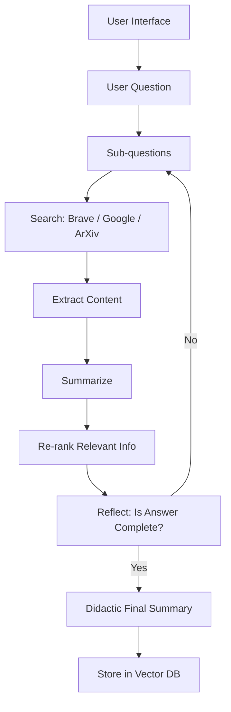

# 🧠 Advanced Deep Research

**Advanced Deep Research** is an autonomous multi-agent research framework designed to simulate a human-level deep researcher. It breaks down complex queries into actionable sub-questions, performs real-time searches across multiple sources (web, papers, and local vector DB), and synthesizes the most relevant information into clear, didactic summaries.

---

## 🚀 Features

- 🔍 Sub-question generation using a local LLM (Qwen 2.5)
- 🌐 Web search via Brave Search, Google, or SerpAPI
- 📄 Advanced content extraction from HTML and PDFs (with `pymupdf4llm`)
- ✍️ Chunked summarization using `facebook/bart-large-cnn` (fine-tuned)
- 🎯 Relevance filtering via `jina-reranker-v2-base-multilingual` (threshold: 0.5)
- 🗂 Knowledge storage in a local vector DB (Qdrant)
- 🤖 Reflective agent to determine when to stop searching
- 📘 Final summarizer agent for clear, didactic answers

---

## ⚙️ Tech Stack

| Component            | Technology/Model                             |
|----------------------|----------------------------------------------|
| LLM (main)           | Qwen 2.5 via vLLM (OpenAI-compatible API)    |
| Embeddings           | `jinaai/jina-embeddings-v3`                  |
| Summarization        | `facebook/bart-large-cnn`                    |
| Re-ranker            | `jinaai/jina-reranker-v2-base-multilingual`  |
| Vector Storage       | Qdrant                                       |
| PDF Parsing          | `pymupdf4llm`                                |
| Web Search           | Brave API, Google (local), SerpAPI           |
| Backend              | FastAPI + Transformers(Hugging Face)         |

---

## 📂 Project Structure

```text
resumidor/
├── cache/                   # Caching utilities
├── config/                  # Configuration and environment handling
├── databases/               # DB integrations (e.g., Qdrant)
├── deep_searcher/           # Core loop for deep search
├── dockers/                 # Docker configurations
├── factory/                 # Model and service instantiation
├── llm/                     # LLM interaction logic (Qwen, etc.) and tools
├── management/              # Process managers / controllers
├── models/                  # Model loading and handling
├── parsers/                 # Web & PDF content parsers
├── prompt_engineering/      # Prompt templates
├── researchers/             # Research engines
├── schemas/                 # Pydantic schemas
├── server/                  # FastAPI server logic
├── tests/                   # Unit and integration tests
```

---

## 🧰 Installation

### 1. Clone the repository

```bash
git clone https://github.com/prodesk98/advanced-deep-research.git
cd advanced-deep-research
```

### 2. Setup environment variables

Copy `.env.example` to `.env` and set your keys:

```bash
cp .env.example .env
```

Fill in your credentials:
```
GOOGLE_SEARCH_ENGINE=local,brave,serpapi
CRAWLER_ENGINE=local,firecrawl
BRAVE_API_KEY=your_key
SERPAPI_KEY=your_key
FIRECRAWL_API_KEY=your_key
HF_TOKEN=your_huggingface_token
```

### 3. Install dependencies

Using Poetry (recommended):

```bash
pip install poetry
poetry install
```

Or using pip:

```bash
pip install -r requirements.txt
```

---

## ▶️ Running the Server

```bash
poetry run fastapi run server/main.py
```

To run the Streamlit debugging interface:

```bash
poetry run streamlit run app.py
```

---

## 🐳 Docker Deployment

```bash
docker compose up -d
```

App runs at: `http://localhost:8501`

---

## 🧠 Research Pipeline (Simplified)



---

## 📌 Roadmap

- [x] Sub-questioning + multi-source search
- [x] ArXiv PDF extraction
- [x] Chunked summarization with BART
- [x] Reranker filtering (threshold-based)
- [x] Reflective agent for iterative research
- [x] Final summarizer for clarity
- [ ] CLI / Web Interface
- [ ] Export to Markdown / PDF
- [ ] Chrome/Firefox extension for contextual search

---

## 📜 License

MIT License

---

## 🤝 Contributing

Open issues, submit pull requests, or suggest improvements!  
All contributions are welcome.
